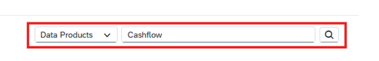
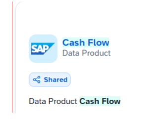
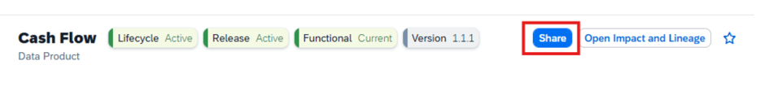
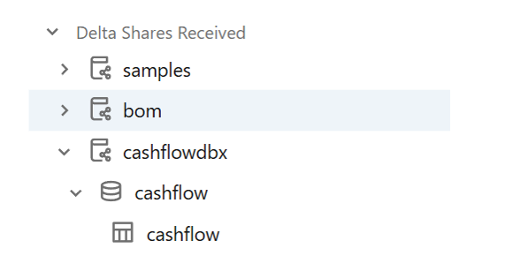
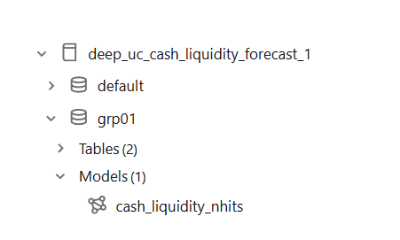

# STEP 1:
Login to SAP Business Data Cloud Cockpit and click on Searchto navigate to the Data Catalog and 
Search for the data product Cashflow and click on the tile to open.
 

 

# ----------------------------------------------------------
# STEP 2: 
On the detail page click on the Share-button and share with linked Databricks system.
 

 
 
# ----------------------------------------------------------
# STEP 3:
Login SAP Databricks and navigate to the Unity Catalog  Navigate to the Delta Shares Received, find the table cashflow.
 

 
# ----------------------------------------------------------

# STEP 4:
Before you start writing the code to get the timeseries data and to generate trained model. Better to create one space for you. For Ex: I created , Schema "grp01" and catalogue "deep_uc_cash_liquidity_forecast_1" in Databricks

# ----------------------------------------------------------

# STEP 5:
Following code is to use the cashflow data product and Prepare data for time series forecasting
 
%pip install databricks-feature-engineering==0.13.0
%restart_python
from pyspark.sql import SparkSession
from databricks.feature_engineering import FeatureEngineeringClient, FeatureLookup
from pyspark.sql import SparkSession
from pyspark.sql.functions import to_date, col, date_trunc, sum, explode, sequence, min, max, lit, expr
spark = SparkSession.builder.appName("cash_flow_data_preparation").getOrCreate()
data = spark.read.table("cashflowdbx.cashflow.cashflow")
#Floor date and rename columns
data = data.\
    withColumn("PostingDate", date_trunc("month", col("PostingDate")).cast("date")).\
    withColumnsRenamed({"PostingDate": "ds", "Company_Code": "CompanyCode", "AmountInCompanyCodeCurrency": "y"})
#aggregate time series on date and sum cash flow into a dataframe time_series_data
time_series_data = data.\
    select("ds", "CompanyCode", "y").\
    groupBy("ds", "CompanyCode").\
    agg(sum("y").alias("y")).\
    orderBy("ds")
#generate continous time series sequence
date_sequence_data = time_series_data\
    .select(
        explode(
            expr("sequence(min(ds), max(ds), INTERVAL 1 MONTH)")
            ).alias("ds"))
date_company_combination = time_series_data.select("CompanyCode").\
    distinct().\
    join(date_sequence_data, how="cross")
#join time series data together with time series sequence
time_series_data = time_series_data.\
    join(date_company_combination, on=["ds", "CompanyCode"], how="right").\
    fillna(0, subset=["y"])
display(time_series_data)
#(A) Set / create catalog & schema from Python
spark.sql("CREATE CATALOG IF NOT EXISTS deep_uc_cash_liquidity_forecast_1")
spark.sql("USE CATALOG deep_uc_cash_liquidity_forecast_1")
spark.sql("CREATE SCHEMA IF NOT EXISTS grp01")
spark.sql("USE SCHEMA grp01")
fe_client = FeatureEngineeringClient()
full_table_name = "deep_uc_cash_liquidity_forecast_1.grp01.prepared_cash_flow_time_series"
fe_client.create_table(
    name=full_table_name,
    primary_keys=["CompanyCode", "ds"],
    schema=time_series_data.schema,
    description="Prepared Cash Flow Time Series data"
)
fe_client.write_table(
    name=full_table_name,
    df= time_series_data,
    mode="merge"
)

# ----------------------------------------------------------

# STEP 6:
 In case, your volume of data is too small then increase the volume of data by some random values else you will find issues running the code to train the model. 
 
from pyspark.sql import SparkSession
#from databricks.feature_engineering import FeatureEngineeringClient, FeatureLookup
from pyspark.sql import functions as F
#(A) Set / create catalog & schema from Python
#spark.sql("USE CATALOG workspace")
#spark.sql("USE SCHEMA default")
catalog = "deep_uc_cash_liquidity_forecast_1"
schema  = "grp01"
table   = "prepared_cash_flow_time_series"
full_name = f"{catalog}.{schema}.{table}"
df = spark.table(full_name)
df = spark.read.table(full_name)
display(df)
#Bounds for randoms
min_val = F.lit(1.0)
max_val = F.lit(100000.0)
#Build a random value in [min_val, max_val], with optional seed
rand_col = F.rand()  # or F.rand(seed=20260223)  # reproducibl
df_updated = (
    df.withColumn(
        "y",
        F.when(F.col("y") == 0,
               F.floor(min_val + rand_col * (max_val - min_val + F.lit(1.0)))
              ).otherwise(F.col("y"))
            .cast(df.schema["y"].dataType)  # keep original type
    )
)
#Overwrite the table atomically
df_updated.write.format("delta").mode("overwrite").option("overwriteSchema", "false").saveAsTable(full_name)
df = spark.read.table(full_name)
display(df)
 
Step7: 
Train the forecasting model
 
We are using:
•	mlflow: Tracking of our ML model
•	neuralforecast: is a comprehensive suite of neural network-based models for time series forecasting. It's designed to be scalable, user-friendly, and highly performant, making it suitable for both researchers and practitioners.
 
#---------- Dependencies ----------
#NOTE: In Databricks, use '==' for versions.
%pip install pydantic==1.10.13
%pip install mlflow==3.5.0
%pip install neuralforecast==3.1.2
#%restart_python
 
#---------- Imports ----------
import pydantic
import ray
import mlflow
import neuralforecast
import pandas as pd
import os
import pickle
from pyspark.sql.functions import col
from neuralforecast.core import NeuralForecast
from neuralforecast.auto import AutoNHITS
from neuralforecast.models import NHITS
#import mlflow
from mlflow.models import infer_signature
from mlflow.client import MlflowClient
#---------- Catalog / Table ----------
catalog = "deep_uc_cash_liquidity_forecast_1"
schema  = "grp01"
table   = "prepared_cash_flow_time_series"
full_name = f"{catalog}.{schema}.{table}"
#---------- Load & basic prep ----------
data = spark.read.table(full_name).select("ds", "CompanyCode", "y")
data = data.withColumn("y", col("y").cast("float"))
FORECAST_LENGTH = 6
#Train/test split by last 'h' dates
unique_date = data.select("ds").distinct().orderBy("ds")
test_date = spark.createDataFrame(unique_date.tail(FORECAST_LENGTH))   # last h dates
train_date = unique_date.join(test_date, "ds", "leftanti")
train_data = data.join(train_date, "ds", "inner")
test_data  = data.join(test_date,  "ds", "inner")
train_data_df = train_data.toPandas()
train_data_df["ds"] = pd.to_datetime(train_data_df["ds"])
test_data_df = test_data.toPandas()
test_data_df["ds"] = pd.to_datetime(test_data_df["ds"])
#---------- MLflow setup ----------
mlflow.set_tracking_uri("databricks")
mlflow.set_registry_uri("databricks-uc")
mlflow.pytorch.autolog(checkpoint=False, log_every_n_epoch=100, log_datasets=True, log_models=True)
#---------- AutoNHITS (hyperparameter search) ----------
def nhits_config(trial):
    # Keep training small & allow padding
    return {
        "input_size": trial.suggest_int("input_size", 6, 12),
        "start_padding_enabled": True,
        "max_steps": 100,
    }
nf = NeuralForecast(
    models=[AutoNHITS(
        h=FORECAST_LENGTH,
        backend="optuna",
        num_samples=5,
        config=nhits_config
    )],
    freq="MS"
)
nf.fit(train_data_df, id_col="CompanyCode")
results = nf.models[0].results.trials_dataframe()
results = results[results["state"] == "COMPLETE"].sort_values(by="value", ascending=True)
best_row = results.iloc[0]
best_params = {k.replace("params_", ""): best_row[k] for k in results.columns if k.startswith("params_")}
display(best_params)
#--------- Build a safe parameter set ----------
df = data.toPandas()
df["ds"] = pd.to_datetime(df["ds"])
#per-series lengths
lens = (
    df.groupby("CompanyCode")["ds"]
      .size()
      .astype(int)
)
safe_cap = max(2, min(int(lens.min()) - FORECAST_LENGTH, 12))  # prevent oversize windows
safe_params = dict(best_params)
safe_params["start_padding_enabled"] = True
safe_params["input_size"] = int(min(safe_params.get("input_size", safe_cap), safe_cap))
#---------- PyFunc wrapper ----------
class NeuralForecastPyFunc(mlflow.pyfunc.PythonModel):
    def load_context(self, context):
        import cloudpickle
        with open(context.artifacts["nf_path"], "rb") as f:
            self.nf = cloudpickle.load(f)
    def predict(self, context, model_input):
        if not isinstance(model_input, pd.DataFrame):
            raise TypeError("model_input must be a pandas DataFrame")
        # intervals disabled for stability; add level=[90] later if needed
        return self.nf.predict(df=model_input)
#---------- Train + Log + Register ----------
with mlflow.start_run() as run:
    # 1) Train final NHITS with SAFE params
    final_model = NeuralForecast(
        models=[NHITS(h=FORECAST_LENGTH, **safe_params)],
        freq="MS"
    )
    final_model.fit(df, id_col="CompanyCode")
    # 2) Predictions (on train slice just to build signature & plot)
    prediction = final_model.predict(train_data_df)
    # 3) Signature & serialize
    x_example = train_data_df.head(5)
    signature = infer_signature(x_example, prediction)
    model_path = "neuralforecast_model.pkl"
    with open(model_path, "wb") as f:
        pickle.dump(final_model, f)
    # 4) Log to MLflow as PyFunc
    mlflow.pyfunc.log_model(
        artifact_path="model",
        python_model=NeuralForecastPyFunc(),
        artifacts={"nf_path": model_path},
        input_example=x_example,
        signature=signature
    )
    # 5) Register in Unity Catalog (make sure you have permissions on this UC path)
    registry_name = "deep_uc_cash_liquidity_forecast_1.grp01.cash_liquidity_nhits"
    model = mlflow.register_model(
        model_uri=f"runs:/{run.info.run_id}/model",
        name=registry_name
    )
#6) Set alias once (outside the run)
mlflow_client = MlflowClient()
mlflow_client.set_registered_model_alias(
    name=registry_name,
    alias="prod",
    version=model.version
)
#7) Plot predictions (ID column correct)
from utilsforecast.plotting import plot_series
plot_series(train_data_df, prediction, id_col="CompanyCode")
print("Shortest series length:", int(lens.min()))
print("Chosen input_size:", safe_params["input_size"])
assert safe_params["input_size"] >= 2, "input_size must be >= 2"
assert safe_params["input_size"] + FORECAST_LENGTH <= int(lens.min()), \
    "input_size + horizon must not exceed the shortest series length"
 
After execution of the above code, You can see Model "Cash_liquidity_nhits"

# ----------------------------------------------------------
 
 
# STEP 8:
Forecast the cash flow by using the trained model and applying it to the data product Cashflow.
 
 
#Install dependencies
%pip install pydantic==1.10.13
%pip install mlflow
%pip install neuralforecast==3.1.2
%restart_python
#---------- Imports ----------
import pandas as pd
import os
import pickle
from pathlib import Path
import mlflow
from mlflow.models import infer_signature
from mlflow.client import MlflowClient
from pyspark.sql import SparkSession
from pyspark.sql.functions import col
from delta import *
#---------- Catalog / Table ----------
catalog = "deep_uc_cash_liquidity_forecast_1"
schema  = "grp01"
table   = "prepared_cash_flow_time_series"
full_name = f"{catalog}.{schema}.{table}"
#---------- Load & basic prep ----------
time_series_data = (
    spark.read.table(full_name)
    .select("ds", "CompanyCode", "y")
    .withColumn("y", col("y").cast("float"))
)
time_series_df = time_series_data.toPandas()
#---------- Load UC Model ----------
mlflow.set_registry_uri("databricks-uc")
model = mlflow.pyfunc.load_model(
    "models:/deep_uc_cash_liquidity_forecast_1.grp01.cash_liquidity_nhits/1"
)
#---------- Predict ----------
prediction = model.predict(time_series_df)
prediction = prediction.rename(
    mapper={
        "ds": "date",
        "NHITS": "forecast",
        "NHITS-lo-90": "lower_forecast",
        "NHITS-hi-90": "upper_forecast"
    },
    axis=1
)
#---------- Save to Delta Lake ----------
prediction = spark.createDataFrame(prediction)
prediction = prediction.withColumn("date", col("date").cast("date"))
prediction = prediction.withColumn("CompanyCode", col("CompanyCode").cast("string"))
prediction.write.format("delta")\
    .mode("overwrite")\
    .option("delta.enableChangeDataFeed", "true")\
    .option("delta.enableDeletionVectors", "true")\
    .saveAsTable("deep_uc_cash_liquidity_forecast_1.grp01.cashflow_prediction")
 
After execution of above code, You can find generated table:
 
# ----------------------------------------------------------
 
# STEP 9:
To  publish the cashflow prediction results to the data catalog of SAP Business Data Cloud. For that you can build a custom data product by using the python library sap-bdc-connect-sdk. You can utilize the Delta Share protocol, which allows you share the data product without the need of copying the result table. The result table remains persisted in SAP Databricks, and will be remotely accessible from the data catalog.
 
 
Once your custom Data production if available for Cashflow with Forecasted data then you can use that data product directly in SAP Aanltyics Cloud and show the forecast reports on the Cashflow. 
 
Please Try to use your custom Data Product in SAC Or Intelligent app & share details with me too. 
# Happy Learning 😊 

Cheers:
Deepesh Gupta
 
 
 

